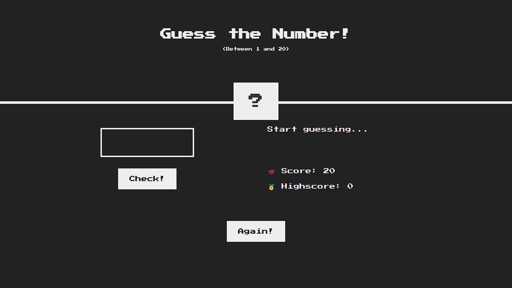

# Guess the Number!

This project is part of the [**"The Complete JavaScript Course 2024: From Zero to Expert!"**](https://www.udemy.com/the-complete-javascript-course/?couponCode=C3GITHUB10) on **Udemy** by **_Jonas Schmedtmann_**.

## How to Play

1. Go to this **_[link](https://darkoray.github.io/Guess-the-number/)_**.

2. The game generates a random number between `1` and `20`.

3. The player has to guess the number:

- The game provides feedback if the guess is too high or too low.
- The player can continue guessing until the correct number is found.
- A reset option is available to start a new game.

4. The player can track their score and aim to beat their highest score.

## Technologies Used

- HTML
- CSS
- JavaScript (DOM and Events Fundamentals)
